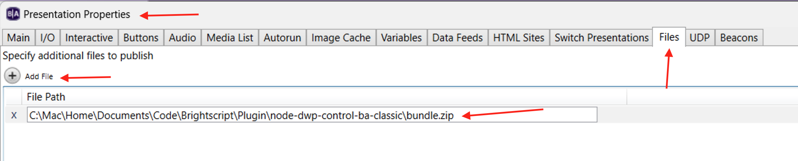
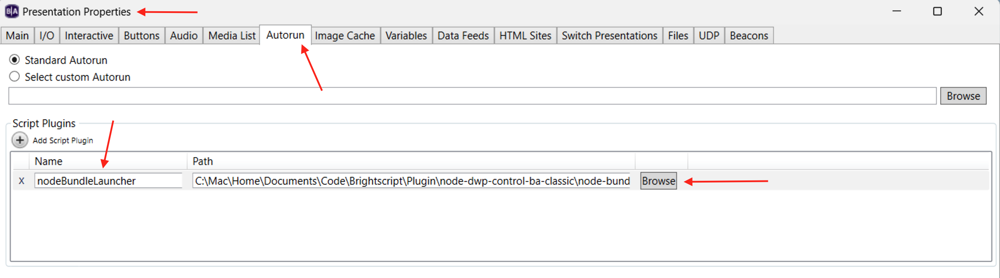
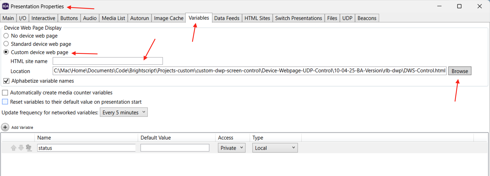

# Instructions on how to add this app to BrightAuthor Classic

Follow the steps below to add this app to an existing BA Classic presentation.

---

## Step 1: Add `bundle.zip` to the Project Files

1. With the project open, go to **Edit > Presentation Properties**.
2. Click the **Files** tab.
3. Click **Add File**.
4. Select the `bundle.zip` file from the project folder to include it in the presentation.

---

## Step 2: Add the Script Plugin

1. In the **Presentation Properties** window, go to the **Autorun** tab.
2. Under **Script Plugins**, click **Add Script Plugin**.
3. Enter `nodeBundleLauncher` as the plugin name.
4. Click **Browse** and select the file named `node-bundle-launch.brs`.

---

## Step 3: Add the Custom Device Web Page

1. Still in **Presentation Properties**, go to the **Variables** tab.
2. Scroll to **Custom Device Web Page**.
3. Click **Add** to create a new custom device web page.
4. Enter a name (e.g., `ControlPage`).
5. Browse to the folder containing `DWS-Control.html` and select it.

---

## Step 4: Publish the Presentation

---

## Notes

- Make sure to update the player OS to the latest OS version available on the brightsign.biz site.