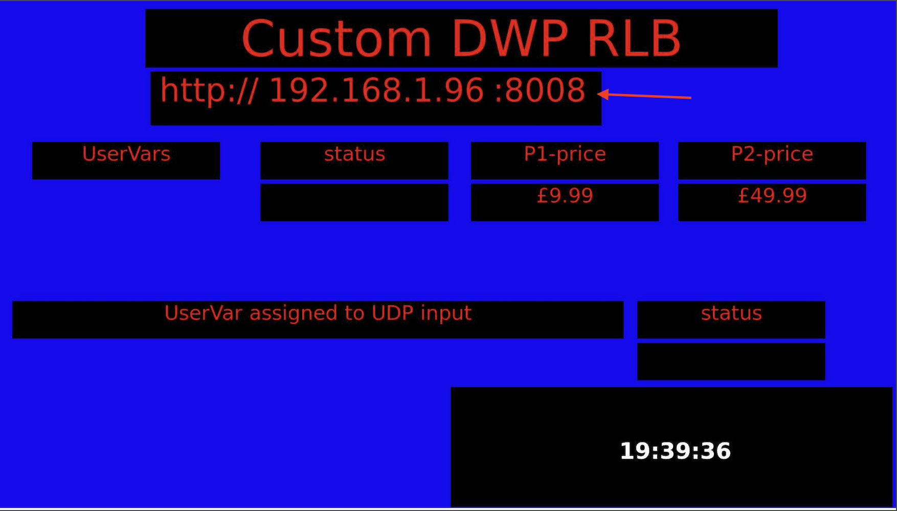
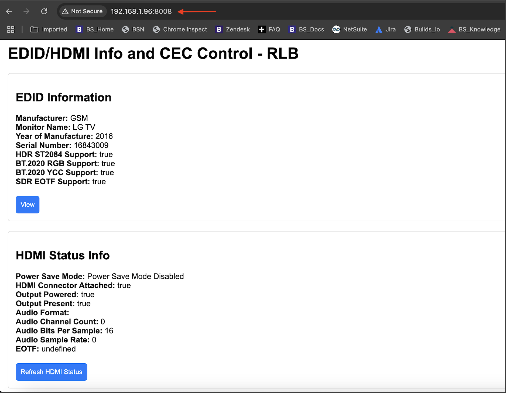
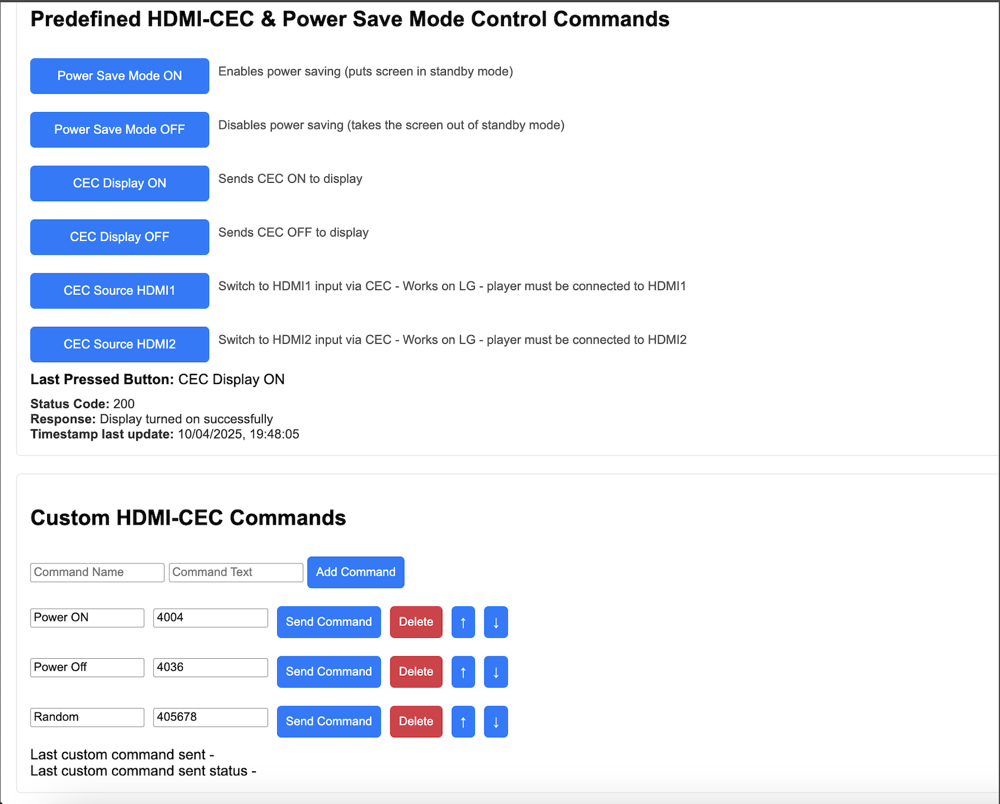
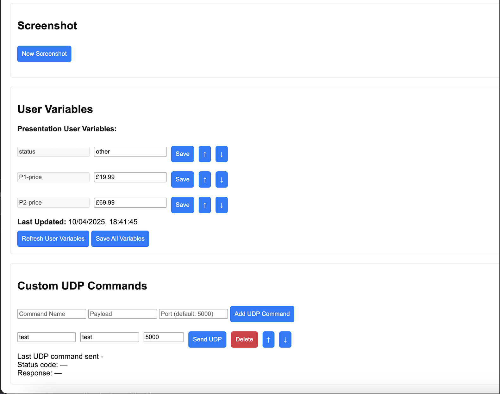

# 🎛️ RLB Device Control Web Interface

A browser-based UI to control and monitor **BrightSign** devices. Features include HDMI-CEC command execution, screenshot preview, user variable management, and custom UDP transmission.

---

## 🚀 Features

### 🔌 HDMI-CEC & Power Save Commands
- Send predefined HDMI-CEC commands (e.g., power ON/OFF, LG input source switch).
- Displays real-time command status with response codes and timestamps.

### 📷 Screenshot Preview
- Capture screenshots of current display output.
- Timestamped image preview with cache-busting updates.

### 📺 EDID & HDMI Status
- View connected display’s EDID information (manufacturer, model, etc).
- HDMI connection, audio, and power save status shown in real-time.

### 🧠 User Variables
- Display BrightAuthor user variables dynamically.
- Inline editing with Save per variable or Save All option.
- Rearrangement with ↑ / ↓ buttons.

### 🧾 Custom HDMI-CEC Commands
- Add, delete, or modify custom HDMI-CEC commands.
- Send them directly from the interface.
- Commands are saved and persist across sessions.
- Supports reordering.

### 📡 Custom UDP Commands
- Send raw UDP payloads to a specified port.
- Each command includes:
  - Name
  - Payload (message)
  - Target port
- Commands are persistent and reorderable.

---

Unzip the attached exported presentation and publish it with BrightAuthor:Connected 1.59.0 (or above) to a Series 5 player (should also work on Series 4 players).

The player Device Web Page (DWP) can be accessed on port 8008. The presentation should display the player IP address and the URL that you will have to enter in your web browser to access the player DWP.

from the below section the connected display EDID information can be checked as well as the HDMI status from HDMI1 (only 1 output can be checked and controlled with this application)

In the below section the user can Enable/Disable Power Save Mode, send some predefined CEC commands (tested on LG screen) and send custom CEC commands by entering a name and a HEX string to be sent when clicking on the "Send Command" button.

in the last sections below the user can take a screenshot of what is currently displayed on the screen, check and update the BrightAuthor:Connected user variables listed.

The "Custom UDP Commands" section allows to create and send a UDP message to the player on any port that is specified for that command.

